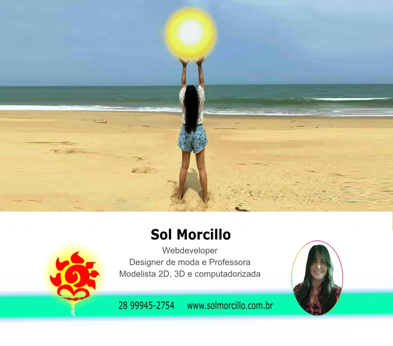

   &nbsp; &ensp; &nbsp;  &nbsp; &ensp; &nbsp; 

---
 

  
   &nbsp; &ensp;  &nbsp; &ensp; 
&nbsp; &ensp; 

---
 

  
**GRADUAÇÃO**

 
  
  **WEB DESIGNER**
  
  * Responsiveness
  * Visual Design (UI)
  * Layout Creation
  * Banner Creation
  * Logo Creation
  * Website Maintenance
  * Content Analysis
  * Video Processing
  * Image Processing
  * User Experience (UX)
  * Landing Page Creation

    ---
     
  
  **WEB DEVELOPER**

 

**SOFT SKILLS**

 * Adaptabilidade
 * Comunicação
 * Criatividade
 * Empatia
 * Inteligência emocional
 * Liderança
 * Resiliência
 * Trabalho em equipe

---
 

**HARD SKILLS**

 * Design
 * Edição de imagens e videos
 * Escrita
 * Gestão de equipe
 * Habilidades de apresentação
 * Programação

 ---
 

**ALGUNS CERTIFICADOS ADQUIRIDOS**

* Prompts Inteligentes - Microsoft 50 Anos - DIO - 16/05/2025
* Audaces - Cetiqt RJ
* Web designer - ISeven RJ- 1999

---
 

**ALGUMAS DAS MINHAS POSTAGENS**

 * <a href="https://web.dio.me/articles/o-impacto-da-engenharia-de-prompt-na-programacao-8b628b1ca1fc?back=/articles ">O impacto da engenharia de prompt na programação - DIO </a>

 * <a href="https://web.dio.me/articles/font-boa-para-codar?back=/articles" >Font boa para codar - DIO </a>

 * <a href="https://web.dio.me/articles/zoom-no-visual-studio-code?back=/articles" >Zoom no visual studio code - DIO </a>

 * <a href="https://web.dio.me/articles/adicionando-img-no-background-de-menu-retratil?back=/articles">Adicionando img no background de menu retrátil - DIO </a>

---
 

  
**PRODUCTS DEVELOPED**

* 80 cm ruler
* Hook ruler
* Hollow doll ruler/square

Material: PETG  
Creation tool: CorelDRAW  
Watch on YouTube the <a href="https://youtu.be/VmiQWrJMKYA?si=CLvEnXqrqiBRzNRV" target="_blank" > MoModIn rulers</a>
                            

---
 

