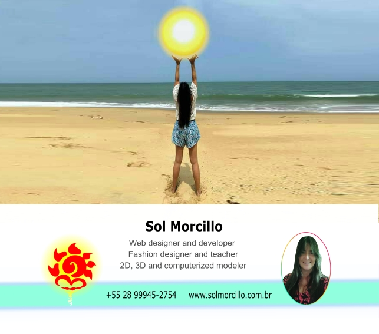
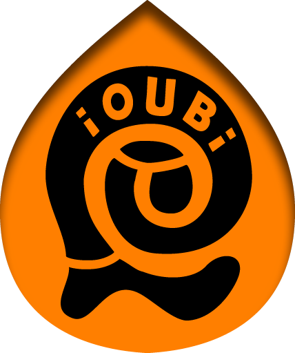
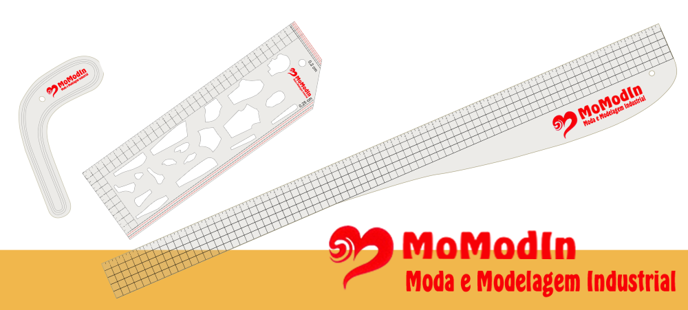

   &nbsp; &ensp; &nbsp;  &nbsp; &ensp; &nbsp; 
&nbsp; &ensp;&nbsp;
   &nbsp; &ensp;  &nbsp; &ensp; 
&nbsp; &ensp; 

 

 

Hello !!! Greetings !!!  
Liking to code is living in constant UPLOAD
<h3> I LOVE CODING </h3>

 

  

**WEB DESIGNER**

&ensp; -%23D90007.svg?style=for-the-badge&logo=Visual&ensp;Design&ensp;(UI)&logoColor=white)

-%2382bd4e.svg?style=for-the-badge&logo=User&ensp;Experience&ensp;(UX)&logoColor=black)

  

    
        <td>User&ensp;Experience&ensp;(UX)</td>
        <td>Landing&ensp;Page&ensp;Creation</td>
    </tr>
</table>

 

<table border="1">
    <tr>
        <td>Website creation</td>
        <td>Code development</td>
        <td>Database</td>
    </tr>
</table>

  
  

<table border="1">
    <tr>
        <td>Adaptabilidade</td>
        <td>Comunicação</td>
        <td>Criatividade</td>
    </tr>
    <tr>
        <td>Empatia</td>
        <td>Inteligência emocional</td>
        <td>Liderança</td>
    </tr>
    <tr>
        <td>Resiliência</td>
        <td>Trabalho em equipe</td>
    </tr>
</table>

  

<table border="1">
    <tr>
        <td>Design</td>
        <td>Edição de imagens e vídeos</td>
        <td>Escrita</td>
    </tr>
    <tr>
        <td>Gestão de equipe</td>
        <td>Habilidades de apresentação</td>
        <td>Programação</td>
    </tr>
</table>

  

* 
* Prompts Inteligentes - Microsoft 50 Anos - DIO - 16/05/2025
* Audaces - Cetiqt RJ
* Web designer - ISeven RJ- 1999

  

* The impact of prompt engineering on programming &ensp;  &ensp;

* Super cool font for coding &ensp; 
&ensp; 

* Zoom in visual studio code &ensp; 
&ensp; 

* Adding img to the background of a retractable menu &ensp; 
&ensp; 

---
 

  

* 80 cm ruler
* Hook ruler
* Hollow doll ruler/square

Material: PETG  
Creation tool: CorelDRAW  
Watch on YouTube the <a href="https://youtu.be/VmiQWrJMKYA?si=CLvEnXqrqiBRzNRV" target="_blank" > MoModIn rulers</a>
                            

---
 

  

