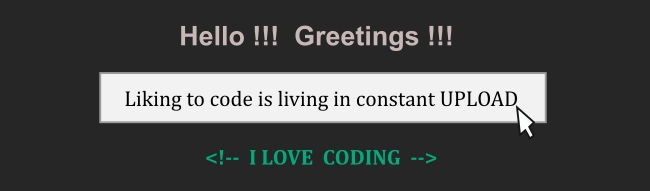

   &nbsp; &ensp; &nbsp;  &nbsp; &ensp; &nbsp; 
&nbsp; &ensp;&nbsp;
   &nbsp; &ensp;  &nbsp; &ensp; 
&nbsp; &ensp; 

  

 

  

**DEGREE**

  

**WEB DESIGNER**

-%23D90007.svg?style=for-the-badge&logo=Visual&ensp;Design&ensp;(UI)&logoColor=white) 
-%2382bd4e.svg?style=for-the-badge&logo=User&ensp;Experience&ensp;(UX)&logoColor=black)

 

**WEB DEVELOPER**

  

**SOF SKILLS**

       
        <td>Resiliência</td>
        <td>Trabalho em equipe</td>
    </tr>
</table>

  

<table border="1">
    <tr>
        <td>Design</td>
        <td>Edição de imagens e vídeos</td>
        <td>Escrita</td>
    </tr>
    <tr>
        <td>Gestão de equipe</td>
        <td>Habilidades de apresentação</td>
        <td>Programação</td>
    </tr>
</table>

  

* 
* Prompts Inteligentes - Microsoft 50 Anos - DIO - 16/05/2025
* Audaces - Cetiqt RJ
* Web designer - ISeven RJ- 1999

  

* The impact of prompt engineering on programming &ensp;  &ensp;

* Super cool font for coding &ensp; 
&ensp; 

* Zoom in visual studio code &ensp; 
&ensp; 

* Adding img to the background of a retractable menu &ensp; 
&ensp; 

---
 

  

* 80 cm ruler
* Hook ruler
* Hollow doll ruler/square

Material: PETG  
Creation tool: CorelDRAW  
Watch on YouTube the <a href="https://youtu.be/VmiQWrJMKYA?si=CLvEnXqrqiBRzNRV" target="_blank" > MoModIn rulers</a>
                            

---
 

  

